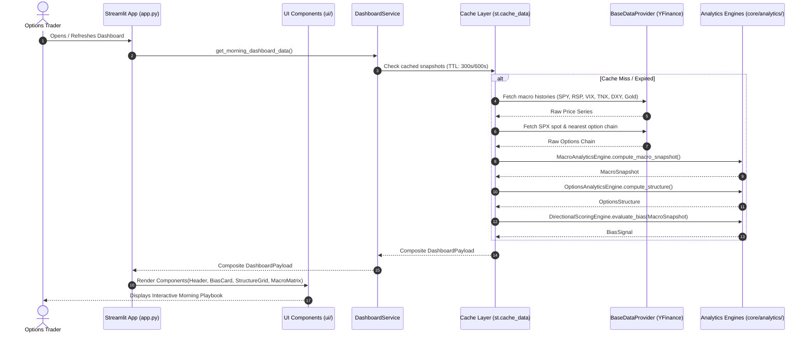
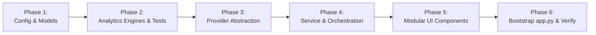

# Architecture & System Design Document

**Project:** Options Trading Dashboard (SPX Morning Playbook)  
**Status:** Design Phase (Refactoring from Proof-of-Concept)  
**Author:** Software Engineering & Architecture Team  
**Date:** October 2026  

---

## 1. Executive Summary & Purpose

The **Options Trading Dashboard** (SPX Morning Playbook) is a specialized decision-support tool engineered for options traders. It aggregates real-time macro indicators and index options chain structure to compute quantitative boundaries, directional sentiment bias, and recommended options trading strategies before the market open.

### Core Objectives
1. **Structural Boundary Discovery**: Identify dealer positioning boundaries (Call Wall / Resistance, Put Wall / Support) and ATM Expected Moves.
2. **Intermarket Macro Bias**: Synthesize intermarket indicators (Treasury yields, US Dollar index, market breadth, volatility, commodities) into an objective directional scoring model.
3. **Actionable Morning Playbook**: Translate structural levels and macro scoring into high-probability option strategy recommendations (e.g., Credit Spreads, Iron Condors, Directional Debit Spreads).
4. **Production Engineering Quality**: Maintain strict separation of concerns, high testability, modular components, and resilience to data feed anomalies.

---

## 2. Current State vs. Target State (Gap Analysis)

### 2.1 Current State (PoC)
The initial implementation (`app.py`) is an monolithic Streamlit script:
- **Tight Coupling**: UI layout, caching, network calls (`yfinance`), and business logic (scoring heuristics, strike approximations) reside in a single 150-line file.
- **Limited Testability**: Business logic cannot be unit tested without running or mocking Streamlit runtimes.
- **Fragile Data Ingestion**: Fallbacks and network failures are handled with ad-hoc `try-except` blocks returning zeroes without health signaling.
- **Rigid Configuration**: Tickers, lookbacks, scoring weights, and cache parameters are hardcoded.

### 2.2 Target Architecture
A modular, layered architecture adhering to **Clean Architecture / Ports & Adapters (Hexagonal)** principles:
- **Core Domain & Analytics**: Pure Python functions and data classes. Zero dependencies on Streamlit or specific data vendors.
- **Provider Layer (Adapters)**: Pluggable market data providers via abstract interfaces. Easy replacement or augmentation (e.g., YFinance $\to$ Tradier / Polygon / Theta Data).
- **Service / Orchestration Layer**: Caching, resilience policies, and composite snapshot generation.
- **UI Component Layer**: Pure presentation components receiving typed domain models.

---

## 3. Architectural Principles

1. **Separation of Concerns (SoC)**: UI components only render; calculation engines only compute; providers only adapt external APIs.
2. **Dependency Inversion Principle (DIP)**: High-level business logic depends on abstractions (`BaseDataProvider`), never on concrete third-party SDKs.
3. **Determinism & Testability**: Quantitative calculations (walls, expected moves, score calculations) are pure functions, allowing $100\%$ unit test coverage with synthetic fixtures.
4. **Strong Typing & Domain Models**: All entities (quotes, option chains, bias scores) are represented as typed dataclasses / Pydantic models.
5. **Defensive Ingestion & Resilience**: Graceful degradation when index feeds are delayed (e.g., SPX index fallback to scaled SPY, stale cache fallback).

---

## 4. System Architecture & Component Diagram

```mermaid
flowchart TD
    subgraph Presentation["Presentation Layer (Streamlit)"]
        UI["app.py (Entry Point)"]
        CompHeader["Header & Status Component"]
        CompBias["Directional Bias Banner"]
        CompStruct["Structural Levels Grid"]
        CompMacro["Macro Intermarket Matrix"]
    end

    subgraph Service["Application & Orchestration Layer"]
        Orchestrator["MarketDashboardService"]
        CacheMgr["Cache & State Manager"]
    end

    subgraph Domain["Core Domain & Analytics (Pure Python)"]
        Models["Domain Models (Pydantic / Dataclasses)"]
        OptEngine["OptionsAnalyticsEngine"]
        MacroEngine["MacroAnalyticsEngine"]
        Scorer["DirectionalScoringEngine"]
    end

    subgraph Providers["Data Ingestion Layer (Ports & Adapters)"]
        ProviderInterface["BaseDataProvider (Interface)"]
        YFProvider["YFinanceProvider (Adapter)"]
        MockProvider["MockDataProvider (For Testing/Dev)"]
        FutureProvider["Tradier / ThetaData (Future)"]
    end

    UI --> CompHeader
    UI --> CompBias
    UI --> CompStruct
    UI --> CompMacro

    UI --> Orchestrator
    Orchestrator --> CacheMgr
    Orchestrator --> ProviderInterface
    Orchestrator --> OptEngine
    Orchestrator --> MacroEngine
    Orchestrator --> Scorer

    OptEngine --> Models
    MacroEngine --> Models
    Scorer --> Models

    ProviderInterface <|-- YFProvider
    ProviderInterface <|-- MockProvider
    ProviderInterface <|-- FutureProvider
```

---

## 5. Directory & Package Structure

```
trading_dashboard/
├── config/
│   ├── __init__.py
│   └── settings.py              # Central config: tickers, weights, thresholds, TTLs, auth credentials
├── core/                        # Pure domain logic (No Streamlit dependencies)
│   ├── __init__.py
│   ├── models/                  # Typed domain models
│   │   ├── __init__.py
│   │   ├── market.py            # Quote, MacroSnapshot
│   │   ├── options.py           # StrikeGEX, OptionsStructure
│   │   ├── signal.py            # BiasDirection, BiasSignal
│   │   ├── calendar.py          # OpexEvent
│   │   └── session.py           # MarketSession
│   └── analytics/               # Quantitative calculation engines
│       ├── __init__.py
│       ├── options_engine.py    # BS Gamma, OI walls, GEX profiles, Straddle
│       ├── macro_engine.py      # RSP/SPY ratio trend, intermarket deltas
│       ├── scoring_engine.py    # Bias calculation & playbook rule engine
│       ├── calendar_engine.py   # Monthly OpEx & Quad Witching calculations
│       └── session_engine.py    # US equity market session status (Pre/Open/After/Closed)
├── providers/                   # Data ingestion adapters
│   ├── __init__.py
│   ├── base.py                  # BaseDataProvider (Abstract Base Class / Protocol)
│   ├── yfinance_provider.py     # Yahoo Finance implementation with error handling
│   └── mock_provider.py         # Deterministic fixture provider for tests & offline dev
├── services/                    # Orchestration & workflow
│   ├── __init__.py
│   └── dashboard_service.py     # Coordinates providers, analytics, and caching
├── ui/                          # Presentation layer (Streamlit specific)
│   ├── __init__.py
│   ├── auth.py                  # In-app password authentication gate
│   ├── styles.py                # CSS theming & mobile responsiveness
│   ├── charts/                  # Interactive visual charting
│   │   ├── __init__.py
│   │   ├── gex_chart.py         # Plotly GEX profile by strike
│   │   └── price_chart.py       # Adjustable SPX price chart (1D/5D/1M/YTD/1Y) + level overlays
│   └── components/              # Modular UI components
│       ├── __init__.py
│       ├── header.py            # Title, timestamp, refresh triggers
│       ├── bias_card.py         # Directional bias card & playbook recommendations
│       ├── structure_grid.py    # SPX spot, call wall, put wall, expected move
│       ├── macro_matrix.py      # Intermarket indicators & delta metrics
│       └── opex_widget.py       # Upcoming OpEx & Quad Witching countdowns
├── tests/                       # Automated test suite (45 unit tests)
│   ├── __init__.py
│   ├── conftest.py              # Pytest fixtures & mock chains
│   ├── test_auth.py             # Unit tests for authentication gate
│   ├── test_calendar_engine.py  # Unit tests for OpEx & Quad Witching logic
│   ├── test_gex_chart.py        # Unit tests for Plotly GEX builder
│   ├── test_price_chart.py      # Unit tests for SPX price chart & timeframe fetching
│   ├── test_options_engine.py   # Unit tests for walls, GEX & straddle computations
│   ├── test_macro_engine.py     # Unit tests for RSP/SPY slope & % changes
│   ├── test_scoring_engine.py   # Unit tests for bias scoring matrix
│   ├── test_session_engine.py   # Unit tests for market trading session transitions
│   ├── test_providers.py        # Contract tests for providers
│   ├── test_services.py         # Unit tests for DashboardService (multi-ticker & fallback)
│   └── test_ui_components.py    # Unit tests for Streamlit UI rendering
├── app.py                       # Thin Streamlit bootstrap entry point
├── requirements.txt             # Project runtime dependencies
├── requirements-dev.txt         # Dev dependencies (pytest)
└── ARCHITECTURE.md              # System architecture specification
```

---

## 6. Detailed Component Design & Interfaces

### 6.1 Domain Models (`core/models/`)

```python
# core/models/market.py
from dataclasses import dataclass
from typing import Dict, Optional
import pandas as pd

@dataclass(frozen=True)
class Quote:
    symbol: str
    last_price: float
    previous_close: float
    change_pct: float

@dataclass(frozen=True)
class MacroSnapshot:
    quotes: Dict[str, Quote]      # SPY, RSP, VIX, 10Y, DXY, Gold
    breadth_ratio_5d_slope: float # 5-day slope of RSP/SPY

# core/models/options.py
@dataclass(frozen=True)
class StrikeGEX:
    strike: float
    call_gex: float              # Spot * Gamma * Call_OI * 100
    put_gex: float               # -Spot * Gamma * Put_OI * 100 (dealer short put convention)
    net_gex: float               # call_gex + put_gex

@dataclass(frozen=True)
class OptionsStructure:
    underlying_spot: float
    # Open Interest Walls
    call_wall_oi: float          # Highest Open Interest Call Strike
    put_wall_oi: float           # Highest Open Interest Put Strike
    # Gamma Exposure (GEX) Walls & Levels
    call_wall_gex: float         # Highest Call GEX Strike (major upside magnet/resistance)
    put_wall_gex: float          # Lowest/Most negative Put GEX Strike (major downside accelerator/support)
    net_gex_total: float         # Sum of all strike net GEX ($ or shares equivalent)
    zero_gamma_strike: Optional[float]  # Strike where net GEX transitions from + to - (Volatility Flip)
    per_strike_gex: list[StrikeGEX]     # Top strikes GEX breakdown
    # ATM Straddle & Expected Move
    atm_straddle_price: float    # ATM Call Price + ATM Put Price
    expected_move: float         # Absolute +/- range
    expected_range_low: float    # Spot - Expected Move
    expected_range_high: float   # Spot + Expected Move
    is_fallback: bool = False

# core/models/signal.py
from enum import Enum

class BiasDirection(str, Enum):
    BULLISH = "BULLISH"
    BEARISH = "BEARISH"
    NEUTRAL = "NEUTRAL"

@dataclass(frozen=True)
class BiasSignal:
    total_score: int             # e.g., range [-4, +4]
    max_possible_score: int      # 4
    direction: BiasDirection
    factor_breakdown: Dict[str, int]
    playbook_summary: str
    suggested_strategies: list[str]
```

---

### 6.2 Data Provider Interface (`providers/base.py`)

```python
from abc import ABC, abstractmethod
from typing import List, Optional
import pandas as pd

class BaseDataProvider(ABC):
    """Abstract interface defining the market data contract."""

    @abstractmethod
    def get_history(self, symbol: str, period: str = "7d") -> pd.DataFrame:
        """Return historical OHLCV data. Guaranteed to return standard columns: ['Close']."""
        pass

    @abstractmethod
    def get_options_expirations(self, symbol: str) -> List[str]:
        """Return available expiration date strings (YYYY-MM-DD)."""
        pass

    @abstractmethod
    def get_option_chain(self, symbol: str, expiration: str) -> tuple[pd.DataFrame, pd.DataFrame]:
        """Return (calls_df, puts_df) with standardized columns:
        ['strike', 'lastPrice', 'openInterest', 'impliedVolatility']
        """
        pass
```

---

### 6.3 Analytics Engines (`core/analytics/`)

1. **`OptionsAnalyticsEngine`**:
   - `compute_structure(spot: float, calls: pd.DataFrame, puts: pd.DataFrame, dte_days: float = 1.0, risk_free_rate: float = 0.04) -> OptionsStructure`:
     - Finds Open Interest Walls: $\text{Strike}_{\max(OI)}$ for Calls (OI Call Wall) and Puts (OI Put Wall).
     - Identifies ATM Strike ($\min |\text{Strike} - \text{Spot}|$).
     - Computes ATM Straddle Premium = $\text{Call}_{\text{ATM}} + \text{Put}_{\text{ATM}}$ and Expected Move Range $[\text{Spot} - \text{Straddle}, \text{Spot} + \text{Straddle}]$.
     - **Gamma Exposure (GEX) Engine**:
       - Black-Scholes Gamma: $\Gamma = \frac{e^{-qT} N'(d_1)}{S \sigma \sqrt{T}}$, where $d_1 = \frac{\ln(S/K) + (r - q + \frac{1}{2}\sigma^2)T}{\sigma \sqrt{T}}$.
       - Standard normal PDF $N'(x) = \frac{1}{\sqrt{2\pi}} e^{-\frac{1}{2}x^2}$ calculated using standard library `math`.
       - Per-strike Call GEX: $+S \times \Gamma \times \text{Call OI} \times 100$.
       - Per-strike Put GEX: $-S \times \Gamma \times \text{Put OI} \times 100$ (dealer short put convention).
       - Per-strike Net GEX: $\text{Call GEX} + \text{Put GEX}$.
       - Aggregate Net GEX: $\sum \text{Net GEX}$.
       - Call GEX Wall: Strike with highest positive Call GEX (dealer long gamma resistance/magnet).
       - Put GEX Wall: Strike with lowest (most negative) Put GEX (dealer short gamma acceleration/support).
       - Zero Gamma Flip Point: The strike level where cumulative or per-strike Net GEX flips between positive and negative regime.

2. **`MacroAnalyticsEngine`**:
   - `compute_macro_snapshot(history_map: Dict[str, pd.DataFrame]) -> MacroSnapshot`:
     - Calculates 1-day percentage change for $10\text{Y}, \text{DXY}, \text{VIX}, \text{Gold}, \text{SPY}$.
     - Aligns timestamps for `RSP` and `SPY`, computes relative ratio series $\frac{\text{RSP}_t}{\text{SPY}_t}$, and calculates 5-day slope $\Delta_{\text{ratio}} = \frac{R_T - R_0}{R_0}$.

3. **`DirectionalScoringEngine`**:
   - `evaluate_bias(macro: MacroSnapshot) -> BiasSignal`:
     - Applies scoring matrix:
       - RSP/SPY 5D Slope $> 0 \implies +1$, $< 0 \implies -1$
       - 10Y Yield Change $< 0 \implies +1$, $> 0 \implies -1$
       - DXY Change $< 0 \implies +1$, $> 0 \implies -1$
       - VIX Change $< 0 \implies +1$, $> 0 \implies -1$
     - Maps composite score:
       - $\text{Score} \ge +2 \implies \textbf{BULLISH}$ (Suggests: Bull Put Spreads, 7-14 DTE Long Calls)
       - $\text{Score} \le -2 \implies \textbf{BEARISH}$ (Suggests: Bear Call Spreads, 7-14 DTE Long Puts)
       - Otherwise $\implies \textbf{NEUTRAL}$ (Suggests: Rangebound OTM Credit Spreads / Iron Condors)

---

## 7. Data Flow & Sequence



---

## 8. Resilience, Fallbacks & Error Handling

| Scenario | Risk | Mitigation Strategy |
| :--- | :--- | :--- |
| **Delayed Index Quotes** | `^SPX` not updating before 9:30 AM ET | Fallback to `SPY * 10` for spot price calculation; flag `is_fallback=True` in UI. |
| **Missing Options Chain** | Expiration chain empty or API rate-limited | Fallback to rule-of-thumb daily expected move ($0.8\%$ of spot); Call/Put walls set to $\pm 1\%$ spot with warning banner. |
| **Network Failure on Macro** | Any single ticker fails (e.g. `GC=F` timeout) | Isolate each ticker fetch in provider; missing tickers show `N/A` without aborting the entire dashboard. |
| **Zero Open Interest** | Illiquid or non-standard options expirations | Filter `openInterest > 0`; if sum of OI is zero, fallback to standard percentage boundaries. |

---

## 9. Configuration Management (`config/settings.py`)

Centralized configuration via dataclasses/Pydantic:
- **Macro Tickers**: Mapping of logical names to symbols (`SPY`, `RSP`, `^VIX`, `^TNX`, `DX-Y.NYB`, `GC=F`).
- **Options Tickers**: Primary (`^SPX`), Fallback (`SPY`, multiplier `10.0`).
- **Cache TTLs**: Macro data (300 seconds), Options chain (600 seconds).
- **Scoring Weights & Thresholds**: Configurable bias thresholds (e.g., Bullish $\ge 2$, Bearish $\le -2$).

---

## 10. Testing Strategy

1. **Unit Tests (Core Engines)**:
   - `test_options_engine.py`: Test wall selection on synthetic options chains with known max OI strikes, boundary ties, and missing values.
   - `test_macro_engine.py`: Test percentage change calculations, timestamp intersection for RSP/SPY ratio, and edge cases with flat data.
   - `test_scoring_engine.py`: Test all permutations of factor scores (Bullish, Bearish, Neutral, Tie-breaks).
2. **Provider Contract Tests**:
   - `test_mock_provider.py`: Verify that mock data satisfies all domain invariants without network access.
   - Network integration tests marked with `@pytest.mark.integration` (disabled during rapid CI).
3. **UI Component Tests**:
   - Verify UI components render cleanly given mock domain payloads.

---

## 11. Refactoring & Implementation Roadmap



- **Phase 1: Foundation (Config & Models)**
  - Establish `config/settings.py`
  - Implement `core/models/` (`market.py`, `options.py`, `signal.py`)
- **Phase 2: Domain Logic & Verification**
  - Implement `core/analytics/options_engine.py`
  - Implement `core/analytics/macro_engine.py`
  - Implement `core/analytics/scoring_engine.py`
  - Build automated unit tests under `tests/`
- **Phase 3: Ingestion Layer**
  - Define `providers/base.py`
  - Refactor `yfinance` logic into `providers/yfinance_provider.py`
  - Create `providers/mock_provider.py`
- **Phase 4: Service Orchestration**
  - Implement `services/dashboard_service.py` with caching and resilience handling
- **Phase 5: Presentation Components**
  - Break down monolithic UI into `ui/components/` (`header.py`, `bias_card.py`, `structure_grid.py`, `macro_matrix.py`, `styles.py`)
- **Phase 6: Integration & Final Polish**
  - Simplify `app.py` to a clean, declarative 20-30 line bootstrap entry point
  - Run full test suite and verify UI functionality

---

## 12. Future Additions & Feature Backlog

The following candidate features are prioritized for upcoming iterations:

### 12.1 Interactive Expiration Dropdown (0DTE vs. Weeklies vs. Monthly OpEx)
- **Objective:** Give the trader dynamic control over which expiration slice drives the GEX calculations and structural boundaries.
- **Scope & Behavior:**
  - Expiration selector in the UI (`Today (0DTE)`, `This Friday (Weekly)`, `Monthly OpEx`, or full chain).
  - Pass the selected expiration date through `DashboardService` to `OptionsAnalyticsEngine`.
  - Recalculate Black-Scholes $\Gamma$, per-strike Net GEX, Call/Put GEX walls, and straddle expected move for that specific expiration horizon.
  - Useful for distinguishing fast intraday dealer pin risk (0DTE) from multi-week structural gamma regimes (Monthly OpEx).

### 12.2 Actionable Trade Leg Generator & Risk/Reward Calculator
- **Objective:** Automatically bridge the gap between analysis and execution by generating concrete option contract legs matching the active morning bias.
- **Scope & Behavior:**
  - Pure calculation engine (`core/analytics/strategy_engine.py`) taking `BiasSignal` and `OptionsStructure`.
  - Generates concrete strikes:
    - **Bullish Bias:** Bull Put Credit Spread (short leg anchored near Put GEX Wall / Expected Move Low) or Bull Call Debit Spread.
    - **Bearish Bias:** Bear Call Credit Spread (short leg anchored near Call GEX Wall / Expected Move High) or Bear Put Debit Spread.
    - **Neutral / Rangebound Bias:** Defined-risk Iron Condor with short wings at Call and Put GEX walls.
  - Computes actionable trade metrics: Net credit/debit, Max Profit, Max Loss, Return on Risk (RoR %), and Breakeven strikes.
  - Interactive UI card rendering visual risk profile diagrams.

### 12.3 One-Click Pre-Market Trading Plan Exporter
- **Objective:** Provide a fast, friction-free way to export the morning playbook for journaling and team sharing.
- **Scope & Behavior:**
  - Generates a cleanly formatted Markdown / Plaintext morning briefing summarizing:
    - Active Directional Bias and 4-factor scoring breakdown (Yields, DXY, VIX, Breadth).
    - Spot price, Expected Move boundaries ($[\text{Low}, \text{High}]$), and Key GEX Walls.
    - Zero Gamma flip point and dealer volatility regime.
    - Imminent economic catalysts & OpEx timeline for the day/week.
  - Integrated "Copy to Clipboard" UI button tailored for pasting directly into Notion, Obsidian, Discord, or Slack.

